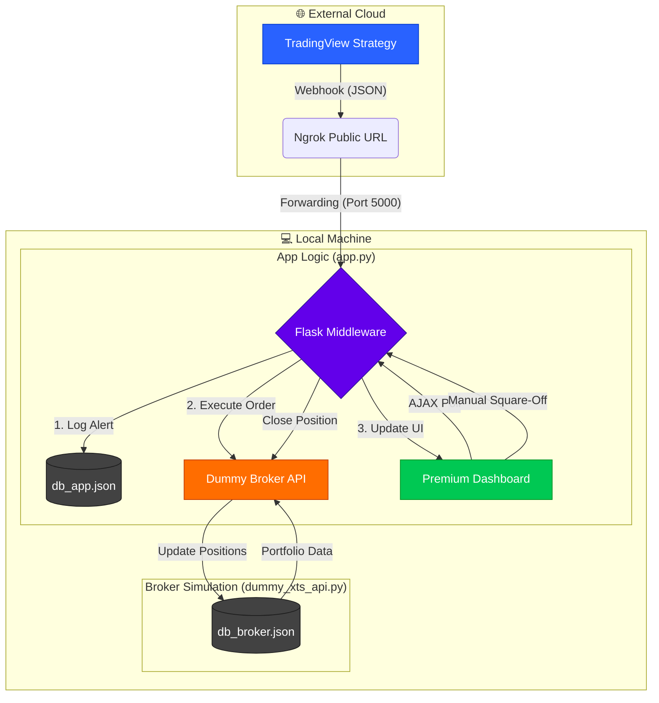

# 🚀 TradingView to XTS Broker Middleware

A robust, real-time middleware designed to bridge TradingView alerts with the XTS Broker API. This system captures webhooks, executes orders, and provides a premium dashboard for monitoring open and closed positions.

---

## ✨ Features

- **Webhook Integration**: Securely receives JSON alerts from TradingView via a Flask-based receiver.
- **One-Click Startup**: Automated batch script to launch the middleware, dummy broker, and ngrok simultaneously.
- **Order Execution**: Automatically forwards orders to the XTS Broker (simulated via Dummy API on port 8001).
- **Premium Dashboard**: A sleek, dark-mode interface with real-time updates and manual controls.
- **Position Management**: 
    - Track **Open Positions** with entry price and time.
    - Track **Closed Positions** with exit price and time.
    - **Manual Square-Off**: One-click position closing directly from the UI.
- **Persistent Memory**: All history (alerts, orders, positions) is saved to local JSON databases (`db_app.json`, `db_broker.json`), surviving server restarts.
- **Simulated Environment**: Includes a `dummy_xts_api.py` for risk-free testing and development.
---

## 🔄 System Flow



---

## 🛠️ Project Structure

```text
├── app.py                # Main Webhook Receiver & Dashboard Server (Port 5000)
├── dummy_xts_api.py      # Simulated XTS Broker API (Port 8001)
├── script.bat            # Automated One-Click Startup Script (Windows Terminal)
├── templates/
│   └── index.html        # Premium Dashboard Frontend
├── db_app.json           # Persistent store for alerts/orders
├── db_broker.json        # Persistent store for broker positions
├── requirements.txt      # Python dependencies
└── .venv/                # Local Python Virtual Environment
```

---

## ⚡ Setup & Quick Start

### 1. Environment Setup
Clone the repository and create a virtual environment:
```bash
python -m venv .venv
source .venv/Scripts/activate  # On Windows: .venv\Scripts\activate
pip install -r requirements.txt
```

### 2. Launch the System (One-Click)
On Windows, simply run the provided batch script. It will open **Windows Terminal** with three tabs:
1. **Middleware App** (Port 5000)
2. **Dummy Broker API** (Port 8001)
3. **Ngrok Tunnel** (Exposing Port 5000)

```bash
script.bat
```

### 3. Manual Startup (Optional)
If you prefer to run components separately:
- **Broker**: `python dummy_xts_api.py` (Runs on http://127.0.0.1:8001)
- **App**: `python app.py` (Runs on http://127.0.0.1:5000)
- **Ngrok**: `ngrok http 5000`

---

## 📈 TradingView Configuration

1. Create a new Alert on TradingView.
2. Set the **Webhook URL** to your ngrok URL: `https://your-ngrok-url/webhook`
3. Set the **Message** (JSON format) as follows:
```json
{
    "symbol": "NIFTY50",
    "action": "BUY",
    "price": "{{close}}"
}
```

---

## 🖥️ Dashboard Overview

- **TradingView Alerts**: Live feed of incoming webhooks.
- **Order History**: Logs of successful or failed order placements.
- **Open Positions**: Active trades with a manual "Square Off" button.
- **Closed Positions**: Historical view of completed trades with timestamps.

---

## 🛠️ Troubleshooting

- **Port Conflicts**: Ensure ports `5000` and `8001` are not being used by other applications.
- **Ngrok Errors**: Ensure you have an active ngrok account and it is configured on your machine.
- **Data Reset**: To clear all history, delete `db_app.json` and `db_broker.json`. The system will recreate them on the next run.
- **Terminal Issue**: If `script.bat` fails to open tabs, ensure you have **Windows Terminal** installed.

---

## 📜 License
MIT License - Created for automated trading research and execution.

